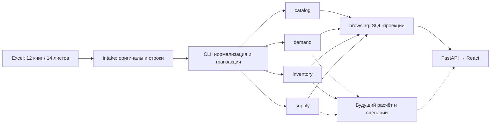

# Архитектура / Architecture

## Client delivery planning

`delivery_planning.py` combines explicit client/SKU forecasts and opening stock with
the pure `routing.py` solver. It owns outbound shipment sizing and shared warehouse
availability checks; it reuses the pure planning contract's quantity types without
importing storage models. `api/deliveries.py` exposes stateless recommendations and
an explicitly loaded Almaty example. This flow performs no database writes and needs
no migration. It is separate from supplier purchasing and adds no frontend code.
See [delivery planning contract](DELIVERY_PLANNING.md).

## Purchasing backend extension / Расширение backend закупок

Migration `0002` adds `orders_scenarios`, immutable `orders_revisions`, and immutable
`orders_approvals` to the 17 source tables described below. `planning` owns import-safe validated
scenario contracts, demand adjustments and exact purchasing arithmetic; it composes the public
`demand.cleaning` policy without changing source observations. `orders` owns only persistence and
workflow commands, depends on `kernel`, and does not import planning or sibling source domains.
`api/orders.py` composes server-side calculation and storage. `planning_sources.py` is a read
composition root using the existing metadata projections, not sibling ORM imports.

Controller integration registers metadata in `schema.py` and routers before the source-table alias.
Inputs/results and source references are pinned per revision; stale writes/approvals/exports are rejected.
All calculable v0 rows are scenario-only while business policies remain unconfirmed. The manager interface
is deferred by user request. See [backend methodology](PLANNING.md) and [contract](../docs/PLANNING_API.md).

Миграция `0002` добавляет три таблицы сценариев к 17 таблицам источников. Чистый `planning` считает,
`orders` хранит версии и утверждения, API связывает их. Источники неизменяемы; интерфейс менеджера отложен.
Ниже сохранено описание исходного слоя v1; фразы о будущем расчёте относятся к состоянию до этого расширения.

## Русский

Модульный монолит по принципам TenderVision: один Python-пакет `replenishment`, PostgreSQL 17, одна история Alembic. Реализованы **17 таблиц**, миграция `0001`, импорт Excel, API чтения и React-интерфейс. Расчёт заказов остаётся следующим этапом.

| Модуль | Владеет | Не делает |
| --- | --- | --- |
| `kernel` | SQLAlchemy Base, UUID и числовой тип | Бизнес-правила, чтение источников |
| `intake` | Оригиналы XLSX, хеши, листы, строки и замечания качества | Выбор истинного спроса или исправление исходников |
| `catalog` | Поставщики, идентичность SKU, наблюдения названия/артикула/единицы/категории, склады | Слияние конфликтующих значений без правил |
| `demand` | Движения, месячные продажи, агрегаты сезонности и значения отчётных расчётов | Превращение продаж в прогноз, автопринятие формул Excel |
| `inventory` | Месячные остатки и компоненты текущих запасов с неопределённостью склада/даты | Суммирование пересекающихся складских колонок |
| `supply` | MOQ/кратность как наблюдения, ожидаемые поставки и строки поставок | Выдумывание lead time или перевод единиц без основания |
| `schema.py` | Сбор metadata для миграции и проверки | Доменная логика, создание соединений при импорте |
| `cli` | Транзакция импорта через публичные `writing.py` модулей | HTTP и расчёт заказов |
| `browsing` | Read-only SQL-проекции через переданную metadata | Запись и выбор канонического источника |
| `api` | HTTP-валидация и сериализация | Парсинг Excel и бизнес-расчёт |

Стрелки показывают поток данных, не разрешение импортировать чужие ORM-модели. Модели модулей зависят только от `kernel`; внешние ключи заданы именами таблиц. `schema.py`, миграции и интеграционные тесты — явные точки сборки. `uv run lint-imports` проверяет независимость пяти модулей и отсутствие доменных зависимостей у `kernel`. Импорт пакетов не читает файлы, окружение и сеть, не подключается к БД.

Команды модулей экспортируются через публичные `writing.py`; парсеры Excel принадлежат `intake/adapters`, межмодульную транзакцию собирает CLI. `browsing` — явная точка сборки SQL-проекций для чтения; он получает metadata и не импортирует чужие ORM-модели. React использует контракт `frontend/src/api/types.ts`; HTTP-контракт и примеры описаны в `API.md`. Прогноз/расчёт будут отделены от SQLAlchemy и HTTP.

### Гарантии хранения

- Оригинальный файл хранится в `intake_workbooks.content`; PostgreSQL проверяет размер и SHA-256. Так сохраняются также скрытые ячейки, стили, изображения и другие объекты, не вынесенные в колонки.
- Строки JSONB — адресуемое представление ячеек: буква колонки → тип, значение, формула, кешированное значение, числовой формат. Отсутствующий ключ означает пустую ячейку; `0` и `#N/A` не теряются. Исходные числовые значения, включая Excel-даты, сохраняются точными строками XML; в типизированных наблюдениях даты преобразуются отдельно.
- Триггеры запрещают UPDATE/DELETE оригиналов, листов и строк. Изменение файла создаёт новую версию с новым хешем. Новая версия нормализатора создаёт новые наблюдения; старые не должны переписываться приложением.
- Типизированные таблицы ссылаются на исходную строку, большинство — и на колонку, все нормализованные наблюдения — на `normalizer_version`. Повтор той же строки/колонки/версии отклоняется уникальным ограничением.
- Количества и коэффициенты — `Numeric(30,12)`, допускают отрицательные значения и NULL. Исходная точность сверх 12 десятичных знаков остаётся в сырье; факт округления при нормализации нужно явно проверять.
- Склады месячных отчётов и снимка Systeme не угадываются. `warehouse_id=NULL` означает неизвестный охват, а не «все склады». Дата из имени файла и год, предположенный по контексту, явно маркируются.
- Не выбираем текущую истину через MAX(id) или просто объединением всех версий. Будущий расчёт должен выбирать конкретные версии источников и сохранять этот набор вместе с результатом.
- Составные FK запрещают связать строку поставки с товаром другого поставщика. Дубликаты строк справочников сохраняются как свидетельства, но не создают дубликаты идентичности SKU.

Точные привязки Excel → таблица: [DATA_MODEL.md](../docs/DATA_MODEL.md). Решения и порядок изменения: [DECISIONS.md](../docs/DECISIONS.md).

## English

A TenderVision-style modular monolith: one `replenishment` distribution, PostgreSQL 17 and one Alembic history. Implemented: **17 tables**, migration `0001`, Excel ingestion, read API and React tables. Order calculation remains subsequent work. `cli` composes public module writers within a workbook transaction; `browsing` composes read-only SQL projections using injected metadata; `api` validates HTTP and serializes results.

Ownership: `kernel` owns persistence primitives; `intake` owns original workbook evidence and quality findings; `catalog` owns supplier-scoped product identities, source attributes and warehouses; `demand` owns movements, monthly sales, seasonality and report metrics; `inventory` owns monthly/current stock; `supply` owns observed quantity rules and incoming shipments. `schema.py` assembles metadata only.

Domain storage packages import only `kernel`, never each other's internals. String foreign keys express relational links. Metadata assembly, migrations and integration tests are composition roots. Import-linter enforces module independence and a domain-free kernel. Package imports have no environment, database, filesystem or network side effects.

Module commands expose public `writing.py` functions. Parsers belong in `intake/adapters`; CLI composes normalization and workbook transactions. `browsing` is an explicit read-composition root with injected metadata, without private ORM imports. React uses `frontend/src/api/types.ts`; `API.md` documents HTTP and examples. Future calculation arithmetic stays independent of ORM and HTTP.

Storage guarantees:

- Store complete XLSX bytes, validating length and SHA-256 in PostgreSQL; this retains objects not mapped to columns.
- JSONB rows provide addressable typed cell values, formulas, cached results and formats. Missing keys mean blanks; zero and Excel errors remain distinct. Numeric values, including Excel date serials, retain exact XML strings; typed observations convert dates separately.
- Triggers reject updates/deletes to workbooks, sheets and raw rows. New file bytes produce a new hash/version. Application code must append new normalizer-version observations rather than rewriting previous ones.
- Typed observations retain source rows, usually source columns, and a normalizer version. Uniqueness prevents replay duplicates for the same source/version.
- Signed nullable `Numeric(30,12)` stores quantities and coefficients; additional source precision remains in raw evidence and rounding must be checked by normalization.
- Unknown warehouse scope stays NULL, distinct from all warehouses. Dates inferred from filenames or missing years are explicitly marked.
- Future calculations must pin source versions; never sum all source versions or infer a current record from an ID.
- Composite foreign keys reject shipment lines linked to another supplier's product. Duplicate source rows remain evidence without duplicating SKU identities.

See [Excel mapping](../docs/DATA_MODEL.md) and [decisions](../docs/DECISIONS.md). No microservices, queues or extra databases are needed for this slice.

Issue #3 adds a pure Decimal policy in `demand/cleaning.py` for derived regular-demand
estimates and document-level bulk candidates. It preserves original quantities in
its returned explanations and writes neither observations nor database state.
Research runners use the same policy at each historical cutoff; see the
[cleaning protocol](../docs/DEMAND_CLEANING.md). Storage tables and API contracts
remain unchanged. / Очистка возвращает объяснимые производные значения отдельно
от неизменяемого сырья; схема БД и API не меняются.
