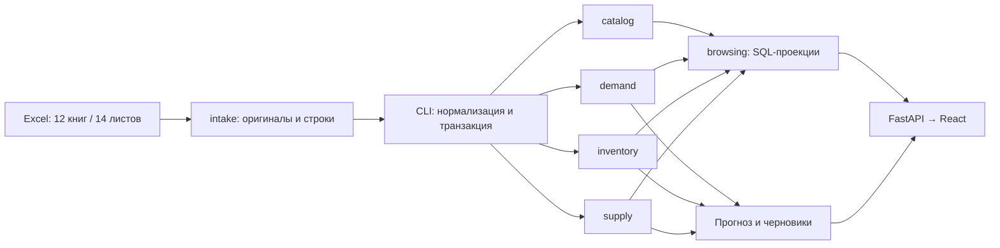

# Архитектура / Architecture

## Русский

Модульный монолит по принципам TenderVision: один Python-пакет `replenishment`, PostgreSQL 17, одна история Alembic. Реализованы **24 таблицы**, миграции `0001`–`0003`, импорт Excel, основной forecast-first расчёт, API чтения и React-интерфейс источников.

| Модуль | Владеет | Не делает |
| --- | --- | --- |
| `kernel` | SQLAlchemy Base, UUID и числовой тип | Бизнес-правила, чтение источников |
| `intake` | Оригиналы XLSX, хеши, листы, строки и замечания качества | Выбор истинного спроса или исправление исходников |
| `catalog` | Поставщики, идентичность SKU, наблюдения названия/артикула/единицы/категории, склады | Слияние конфликтующих значений без правил |
| `demand` | Движения, месячные продажи, агрегаты сезонности и значения отчётных расчётов | Превращение продаж в прогноз, автопринятие формул Excel |
| `inventory` | Месячные остатки и компоненты текущих запасов с неопределённостью склада/даты | Суммирование пересекающихся складских колонок |
| `supply` | MOQ/кратность как наблюдения, ожидаемые поставки и строки поставок | Выдумывание lead time или перевод единиц без основания |
| `schema.py` | Сбор metadata для миграции и проверки | Доменная логика, создание соединений при импорте |
| `calculation` | Канонические входы, чистый прогноз/закупочная арифметика, снимки входов и результаты | Подмена неизвестных фактов, HTTP внутри арифметики |
| `ordering` | Сотрудники, редактируемый документ по всему расчёту, утверждение и блокировка | Изменение рекомендаций, аутентификация, отправка поставщику |
| `cli` | Транзакция импорта через публичные `writing.py`, запуск/экспорт расчёта | HTTP и бизнес-арифметика |
| `browsing` | Read-only SQL-проекции через переданную metadata | Запись и выбор канонического источника |
| `api` | HTTP-валидация и сериализация | Парсинг Excel и бизнес-расчёт |

Стрелки показывают поток данных, не разрешение импортировать чужие ORM-модели. Модели модулей зависят только от `kernel`; внешние ключи заданы именами таблиц. `schema.py`, миграции и интеграционные тесты — явные точки сборки. `uv run lint-imports` проверяет независимость пяти модулей и отсутствие доменных зависимостей у `kernel`. Импорт пакетов не читает файлы, окружение и сеть, не подключается к БД.

Команды модулей экспортируются через публичные `writing.py`; парсеры Excel принадлежат `intake/adapters`, межмодульную транзакцию собирает CLI. `browsing` — явная точка сборки SQL-проекций для чтения; он получает metadata и не импортирует чужие ORM-модели. React использует контракт `frontend/src/api/types.ts`; HTTP-контракт и примеры описаны в `API.md`. Прогноз/расчёт будут отделены от SQLAlchemy и HTTP.

### Гарантии хранения

- Оригинальный файл хранится в `intake_workbooks.content`; PostgreSQL проверяет размер и SHA-256. Так сохраняются также скрытые ячейки, стили, изображения и другие объекты, не вынесенные в колонки.
- Строки JSONB — адресуемое представление ячеек: буква колонки → тип, значение, формула, кешированное значение, числовой формат. Отсутствующий ключ означает пустую ячейку; `0` и `#N/A` не теряются. Исходные числовые значения, включая Excel-даты, сохраняются точными строками XML; в типизированных наблюдениях даты преобразуются отдельно.
- Триггеры запрещают UPDATE/DELETE оригиналов, листов и строк. Изменение файла создаёт новую версию с новым хешем. Новая версия нормализатора создаёт новые наблюдения; старые не должны переписываться приложением.
- Типизированные таблицы ссылаются на исходную строку, большинство — и на колонку, все нормализованные наблюдения — на `normalizer_version`. Повтор той же строки/колонки/версии отклоняется уникальным ограничением.
- Количества и коэффициенты — `Numeric(30,12)`, допускают отрицательные значения и NULL. Исходная точность сверх 12 десятичных знаков остаётся в сырье; факт округления при нормализации нужно явно проверять.
- Склады месячных отчётов и снимка Systeme не угадываются. `warehouse_id=NULL` означает неизвестный охват, а не «все склады». Дата из имени файла и год, предположенный по контексту, явно маркируются.
- Не выбираем текущую истину через MAX(id) или просто объединением всех версий. Будущий расчёт должен выбирать конкретные версии источников и сохранять этот набор вместе с результатом.
- Составные FK запрещают связать строку поставки с товаром другого поставщика. Дубликаты строк справочников сохраняются как свидетельства, но не создают дубликаты идентичности SKU.

Точные привязки Excel → таблица: [DATA_MODEL.md](../docs/DATA_MODEL.md). Решения и порядок изменения: [DECISIONS.md](../docs/DECISIONS.md).

## English

A TenderVision-style modular monolith: one `replenishment` distribution, PostgreSQL 17 and one Alembic history. Implemented: **24 tables**, migrations `0001`–`0003`, Excel ingestion, forecast-first calculation, read API and React source tables. `cli` composes public module writers within a workbook transaction; `browsing` composes read-only SQL projections using injected metadata; `api` validates HTTP and serializes results.

Ownership: `kernel` owns persistence primitives; `intake` owns original workbook evidence and quality findings; `catalog` owns supplier-scoped product identities, source attributes and warehouses; `demand` owns movements, monthly sales, seasonality and report metrics; `inventory` owns monthly/current stock; `supply` owns observed quantity rules and incoming shipments. `schema.py` assembles metadata only.

Domain storage packages import only `kernel`, never each other's internals. String foreign keys express relational links. Metadata assembly, migrations and integration tests are composition roots. Import-linter enforces module independence and a domain-free kernel. Package imports have no environment, database, filesystem or network side effects.

Module commands expose public `writing.py` functions. Parsers belong in `intake/adapters`; CLI composes normalization and workbook transactions. `browsing` is an explicit read-composition root with injected metadata, without private ORM imports. React uses `frontend/src/api/types.ts`; `API.md` documents HTTP and examples. Forecast and purchasing arithmetic stay independent of ORM, HTTP, filesystem and LLM calls. Import-linter enforces these boundaries.

Storage guarantees:

- Store complete XLSX bytes, validating length and SHA-256 in PostgreSQL; this retains objects not mapped to columns.
- JSONB rows provide addressable typed cell values, formulas, cached results and formats. Missing keys mean blanks; zero and Excel errors remain distinct. Numeric values, including Excel date serials, retain exact XML strings; typed observations convert dates separately.
- Triggers reject updates/deletes to workbooks, sheets and raw rows. New file bytes produce a new hash/version. Application code must append new normalizer-version observations rather than rewriting previous ones.
- Typed observations retain source rows, usually source columns, and a normalizer version. Uniqueness prevents replay duplicates for the same source/version.
- Signed nullable `Numeric(30,12)` stores quantities and coefficients; additional source precision remains in raw evidence and rounding must be checked by normalization.
- Unknown warehouse scope stays NULL, distinct from all warehouses. Dates inferred from filenames or missing years are explicitly marked.
- Future calculations must pin source versions; never sum all source versions or infer a current record from an ID.
- Composite foreign keys reject shipment lines linked to another supplier's product. Duplicate source rows remain evidence without duplicating SKU identities.

See [Excel mapping](../docs/DATA_MODEL.md) and [decisions](../docs/DECISIONS.md). No microservices, queues or extra databases are needed for this slice.

## Calculation ownership / Границы расчёта

`calculation.contracts`, `forecasting`, `purchasing` and the `calculate(batch)` entry point own the
pure V2 calculation. `calculation.inputs` reads explicitly selected hashes/versions through injected
metadata. `calculation.models` imports only kernel primitives. `calculation.persistence` owns
transactional result writes and exact stored-quantity CSV export. `calculation.llm` owns bounded
external inference; it is outside numerical arithmetic. `calculation.evaluation` evaluates historical
origins, while ML research dependencies remain outside the production lock until promotion is justified.

`cli.calculate` and `POST /api/v2/calculation/runs` share `calculation.inputs.load_run_batch` to check
selected imports and load one repeatable-read input snapshot. Both invoke the same calculation and
atomic result persistence. PostgreSQL advisory locks serialize identical request fingerprints,
not unrelated calculations. Completed runs are reused unless explicitly rerun; failed writes cannot
leave a completed partial run. `browsing` joins result identities without domain-private ORM imports.

Новый модуль не вводит сервис, очередь, UI закупок или реестр моделей. Исходники и старые эксперименты
неизменяемы; нормализация добавляется новой версией. Три опубликованных месяца и отдельный внутренний
мост текущего месяца описаны в [методологии](../docs/INVENTORY_EVALUATION.md).

## Ordering ownership (migration 0003)

`ordering` owns employee identities, editable documents, and document lines. Its storage imports only
`kernel`; operations read calculation tables through injected metadata without importing calculation
internals. `api.ordering` validates HTTP and composes transactions; `cli.seed_demo` is an explicit fixture
composition root. `schema.py` registers ordering, and import-linter includes it in domain independence.
No new dependency, UI, authentication, supplier submission, reopening, or approval export is introduced.

A unique run reference permits one document per run. Creation locks the run to serialize duplicate requests;
mutations lock the document, check revision/status, validate and commit atomically. Full reads take a shared
document lock so header and line edits form a consistent view. Approval is permanent; database triggers
also block updates/deletes after approval, and line mutations acquire the same parent lock.
