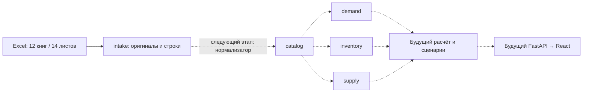

# Архитектура / Architecture

## Русский

Модульный монолит по принципам TenderVision: один Python-пакет `replenishment`, PostgreSQL 17, одна история Alembic. Сейчас реализован слой данных из Excel: **17 таблиц**, миграция `0001`, проверки ограничений PostgreSQL и регрессии аудита. HTTP API, React и расчёт ещё не реализованы.

| Модуль | Владеет | Не делает |
| --- | --- | --- |
| `kernel` | SQLAlchemy Base, UUID и числовой тип | Бизнес-правила, чтение источников |
| `intake` | Оригиналы XLSX, хеши, листы, строки и замечания качества | Выбор истинного спроса или исправление исходников |
| `catalog` | Поставщики, идентичность SKU, наблюдения названия/артикула/единицы/категории, склады | Слияние конфликтующих значений без правил |
| `demand` | Движения, месячные продажи, агрегаты сезонности и значения отчётных расчётов | Превращение продаж в прогноз, автопринятие формул Excel |
| `inventory` | Месячные остатки и компоненты текущих запасов с неопределённостью склада/даты | Суммирование пересекающихся складских колонок |
| `supply` | MOQ/кратность как наблюдения, ожидаемые поставки и строки поставок | Выдумывание lead time или перевод единиц без основания |
| `schema.py` | Сбор metadata для миграции и проверки | Доменная логика, создание соединений при импорте |

Стрелки показывают поток данных, не разрешение импортировать чужие ORM-модели. Модели модулей зависят только от `kernel`; внешние ключи заданы именами таблиц. `schema.py`, миграции и интеграционные тесты — явные точки сборки. `uv run lint-imports` проверяет независимость пяти модулей и отсутствие доменных зависимостей у `kernel`. Импорт пакетов не читает файлы, окружение и сеть, не подключается к БД.

При реализации команд модули экспортируют узкие функции/типы через свой публичный интерфейс; соседние модули не получают общий универсальный repository. Парсеры конкретных Excel принадлежат `intake/adapters`; нормализацию и межмодульную транзакцию собирает CLI. Чистые прогноз/расчёт отделяются от SQLAlchemy и HTTP при начале соответствующих задач. React отображает ответы API, а не дублирует формулы заказа. Для будущего API один совместно версионируемый контракт связывает Pydantic, TypeScript и пример ответа.

### Гарантии хранения

- Оригинальный файл хранится в `intake_workbooks.content`; PostgreSQL проверяет размер и SHA-256. Так сохраняются также скрытые ячейки, стили, изображения и другие объекты, не вынесенные в колонки.
- Строки JSONB — адресуемое представление ячеек: буква колонки → тип, значение, формула, кешированное значение, числовой формат. Отсутствующий ключ означает пустую ячейку; `0` и `#N/A` не теряются. Даты сериализуются как ISO-строки с типом, исходные числовые значения — строками. Это контракт будущего импортера, а не уже готовый импорт.
- Триггеры запрещают UPDATE/DELETE оригиналов, листов и строк. Изменение файла создаёт новую версию с новым хешем. Новая версия нормализатора создаёт новые наблюдения; старые не должны переписываться приложением.
- Типизированные таблицы ссылаются на исходную строку, большинство — и на колонку, все нормализованные наблюдения — на `normalizer_version`. Повтор той же строки/колонки/версии отклоняется уникальным ограничением.
- Количества и коэффициенты — `Numeric(30,12)`, допускают отрицательные значения и NULL. Исходная точность сверх 12 десятичных знаков остаётся в сырье; факт округления при нормализации нужно явно проверять.
- Склады месячных отчётов и снимка Systeme не угадываются. `warehouse_id=NULL` означает неизвестный охват, а не «все склады». Дата из имени файла и год, предположенный по контексту, явно маркируются.
- Не выбираем текущую истину через MAX(id) или просто объединением всех версий. Будущий расчёт должен выбирать конкретные версии источников и сохранять этот набор вместе с результатом.
- Составные FK запрещают связать строку поставки с товаром другого поставщика. Дубликаты строк справочников сохраняются как свидетельства, но не создают дубликаты идентичности SKU.

Точные привязки Excel → таблица: [DATA_MODEL.md](../docs/DATA_MODEL.md). Решения и порядок изменения: [DECISIONS.md](../docs/DECISIONS.md).

## English

A TenderVision-style modular monolith: one `replenishment` distribution, PostgreSQL 17 and one Alembic history. The implemented slice is the Excel data foundation: **17 tables**, migration `0001`, PostgreSQL constraint tests and audit regressions. HTTP API, React and calculation logic are not implemented yet.

Ownership: `kernel` owns persistence primitives; `intake` owns original workbook evidence and quality findings; `catalog` owns supplier-scoped product identities, source attributes and warehouses; `demand` owns movements, monthly sales, seasonality and report metrics; `inventory` owns monthly/current stock; `supply` owns observed quantity rules and incoming shipments. `schema.py` assembles metadata only.

Domain storage packages import only `kernel`, never each other's internals. String foreign keys express relational links. Metadata assembly, migrations and integration tests are composition roots. Import-linter enforces module independence and a domain-free kernel. Package imports have no environment, database, filesystem or network side effects.

Future module commands expose narrow public interfaces, not a universal repository. Source parsers belong in `intake/adapters`; the CLI composes normalization and cross-module transactions. Forecast/replenishment arithmetic stays independent of ORM and HTTP when implemented. React displays API results rather than implementing order arithmetic. A versioned API contract will connect Pydantic, TypeScript and a response example.

Storage guarantees:

- Store complete XLSX bytes, validating length and SHA-256 in PostgreSQL; this retains objects not mapped to columns.
- JSONB rows provide addressable typed cell values, formulas, cached results and formats. Missing keys mean blanks; zero and Excel errors remain distinct. Dates use tagged ISO strings and exact numeric lexemes use strings. This is the future importer's contract, not a completed import pipeline.
- Triggers reject updates/deletes to workbooks, sheets and raw rows. New file bytes produce a new hash/version. Application code must append new normalizer-version observations rather than rewriting previous ones.
- Typed observations retain source rows, usually source columns, and a normalizer version. Uniqueness prevents replay duplicates for the same source/version.
- Signed nullable `Numeric(30,12)` stores quantities and coefficients; additional source precision remains in raw evidence and rounding must be checked by normalization.
- Unknown warehouse scope stays NULL, distinct from all warehouses. Dates inferred from filenames or missing years are explicitly marked.
- Future calculations must pin source versions; never sum all source versions or infer a current record from an ID.
- Composite foreign keys reject shipment lines linked to another supplier's product. Duplicate source rows remain evidence without duplicating SKU identities.

See [Excel mapping](../docs/DATA_MODEL.md) and [decisions](../docs/DECISIONS.md). No microservices, queues or extra databases are needed for this slice.
